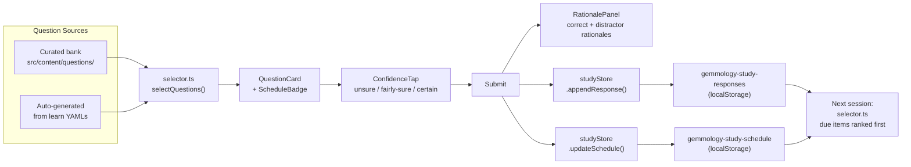
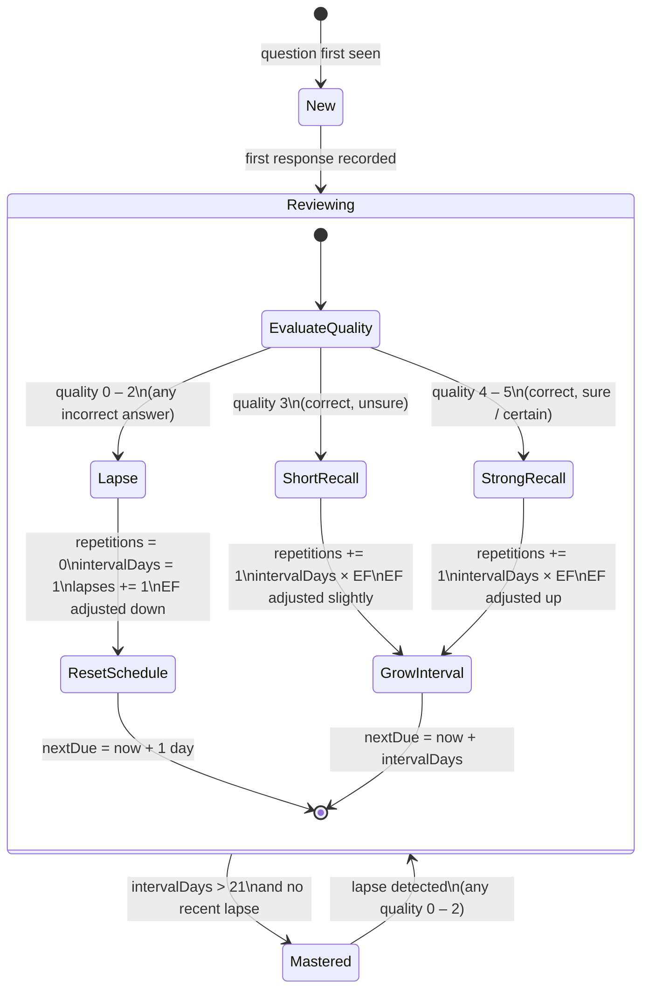
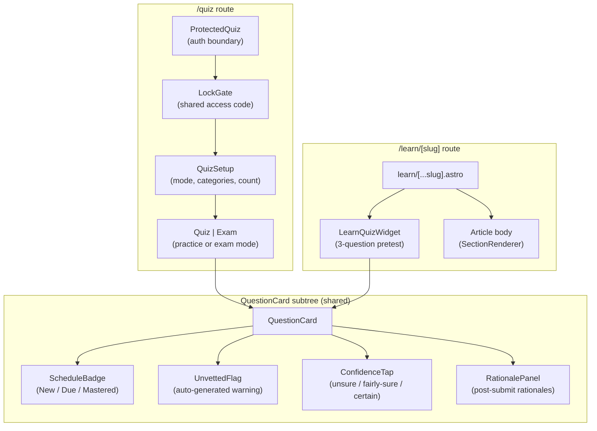

# Study System — v1 Overview

> **Diataxis type:** Explanation — understanding-oriented discussion of the v1 study system architecture, data model, and scheduling algorithm.
>
> **Audience:** [Developer] [Architecture] — future maintainers, contributors integrating new question types, and engineers extending the scheduler.

---

## Purpose

The v1 study system replaces the prototype quiz widget with a research-grounded learning tool. The prototype (described in `REPORT.md §1`) generated questions from YAML learn content on each session start, but treated every attempt as a first attempt — there was no per-question history, no scheduling, and no rationale feedback. The result was a functional self-assessment tool that offered no lasting pedagogical value: users could repeat the same questions indefinitely without the system ever adapting.

Version 1 adds four structural capabilities the prototype lacked. First, every question response is recorded, creating a persistent history ledger that all other features depend on. Second, SM-2 spaced-repetition scheduling prioritises overdue and fragile items in every session, actively fighting the forgetting curve. Third, per-distractor rationales (correct answer and each wrong option) are surfaced after submission, which the evidence base rates as the single highest-leverage pedagogical addition above the baseline testing effect (Butler, Karpicke & Roediger 2007; DOI: 10.1037/1076-898x.13.4.273). Fourth, a confidence tap before answer reveal gives the scheduler a quality signal that distinguishes lucky correct answers from secure recall, and provides the basis for future metacognitive calibration features.

The system continues to support all prototype features — categories, difficulty filter, exam mode, navigation grid, pass/fail threshold — without regression.

See [V1-PLAN.md §1](/Users/fabian/Downloads/gemmology-study-system-review-2026-05-05/V1-PLAN.md) for the full goals and non-goals.

---

## Data Model

> **Diataxis type:** Reference

The study system uses five `localStorage` keys. Three are new in v1; two (`gemmology-quiz-state` and `gemmology-exam-state`) carry over from the prototype with a `confidence` field added.

### Four primary storage keys (v1 additions)

| Key | Purpose | Capped at |
|-----|---------|-----------|
| `gemmology-study-responses` | Append-only response history | 10,000 records |
| `gemmology-study-schedule` | SM-2 scheduling entry per question | Unbounded (one entry per question) |
| `gemmology-study-progress` | Wires up the existing `UserProgress` shape | Single object |
| `gemmology-study-settings` | User preferences (rationale display, confidence required, review mix) | Single object |

A fifth key, `gemmology-study-version` (integer), drives the migration runner.

#### `gemmology-study-responses` — ResponseStore

```ts
// V1-PLAN.md §3.1
type ResponseRecord = {
  questionId: string;          // matches Question.id
  timestamp: number;           // unix ms
  correct: boolean;
  confidence: 'unsure' | 'fairly-sure' | 'certain';
  timeMs: number;              // time spent on the question
  mode: 'practice' | 'exam' | 'pretest';
  optionChosen?: string;       // text or id of selected option
  sessionId: string;           // groups responses from one quiz session
};

type ResponseStore = {
  version: 1;
  responses: ResponseRecord[]; // append-only; capped at 10,000 most recent
};
```

The 10,000-record cap (approximately 1.5 MB JSON) keeps the store within the 5 MB `localStorage` limit. Records are trimmed from the head when the cap is exceeded. The `sessionId` field allows per-session aggregate analysis without a server round-trip.

The `confidence` type will ultimately be defined in `src/lib/quiz/study-types.ts` (the contracts file from the T1 Foundation track). The `Confidence` union `'unsure' | 'fairly-sure' | 'certain'` maps to SM-2 quality values 2–3 / 4 / 5 for correct answers and 2 / 1 / 0 for incorrect answers respectively (see V1-PLAN.md §A4).

#### `gemmology-study-schedule` — ScheduleStore

```ts
// V1-PLAN.md §3.2
type ScheduleEntry = {
  questionId: string;
  nextDue: number;            // unix ms; <=0 means "due now"
  intervalDays: number;       // SM-2 I_n
  easeFactor: number;         // SM-2 EF, starts at 2.5
  repetitions: number;        // consecutive successful recalls (SM-2 n)
  lapses: number;             // total times answered incorrectly
  lastReviewed: number;       // unix ms
  totalReviews: number;
};

type ScheduleStore = {
  version: 1;
  entries: Record<string, ScheduleEntry>; // keyed by questionId
};
```

#### `gemmology-study-settings` — StudySettings

```ts
// V1-PLAN.md §3.5
type StudySettings = {
  version: 1;
  showRationaleOnSubmit: boolean;   // default true
  requireConfidence: boolean;       // default true
  preferredQuestionCount: number;   // last used count
  reviewMixRatio: number;           // 0–1, fraction due vs new, default 0.7
};
```

#### `gemmology-study-progress` — UserProgress

Re-uses the existing `UserProgress` shape from `src/lib/quiz/progress-tracker.ts` (`question-types.ts:164`). The v1 change is that `progressTracker.recordSession` is finally wired into `useQuiz` and `useExam` — it was implemented but never called in the prototype (REPORT.md §2, "One latent bug").

### StorageStore interface

All access goes through a `StudyStore` interface (defined in `src/lib/quiz/store/index.ts`, authored by the T1 Foundation track). The concrete `LocalStudyStore` in `src/lib/quiz/store/local.ts` implements it against `localStorage`. A future `RemoteStudyStore` can slot in without touching any component. See V1-PLAN.md §3.6 for the full interface definition.

---

## Scheduling Algorithm

> **Diataxis type:** Explanation

Version 1 uses **SM-2** (SuperMemo 2), the algorithm behind Anki's classic scheduler. SM-2 operates on each question independently, updating an ease factor and an interval in days after every review.

### Why SM-2 over FSRS

FSRS (Free Spaced Repetition Scheduler) is a more recent algorithm with improved parameter learning, but at the time of the v1 decision no indexed randomised controlled trial had directly compared it to SM-2 in an educational setting (REPORT.md §6, "FSRS vs SM-2 RCT: UNVERIFIED"). SM-2 has a larger published evidence base in medical and professional education (Kornell 2009, DOI: 10.1002/acp.1537; Mohamed 2025, PMID: 41798361), is simpler to unit-test against known reference cases, and represents a well-understood upgrade path for any future migration to FSRS. The full decision is documented in [docs/adr/0001-sm2-vs-fsrs.md](adr/0001-sm2-vs-fsrs.md).

### SM-2 mechanics

The algorithm is implemented in `src/lib/quiz/scheduler.ts` (T2 Algorithms track). Its public surface is a single pure function:

```
updateSchedule(entry, quality, now) → ScheduleEntry
```

Where `quality` is an integer 0–5 derived from the confidence tap × correctness matrix (V1-PLAN.md §A4):

| Correctness | Confidence | SM-2 quality |
|-------------|------------|-------------|
| Correct | Certain | 5 |
| Correct | Fairly sure | 4 |
| Correct | Unsure | 3 |
| Incorrect | Unsure | 2 |
| Incorrect | Fairly sure | 1 |
| Incorrect | Certain | 0 |

When `quality < 3` (any incorrect answer) the algorithm treats the response as a **lapse**: the repetition counter resets to zero and the interval collapses to 1 day. When `quality >= 3` (any correct answer) the interval grows: first recall schedules the next review in 1 day, second recall in 6 days, and every subsequent recall multiplies the previous interval by the ease factor (EF).

The ease factor adjusts after every review according to the standard SM-2 formula, with a minimum clamp of 1.3 to prevent intervals from stagnating indefinitely on difficult items.

### Worked example

A new question (no history) is answered correctly with "certain" confidence (quality = 5):

| Review | quality | repetitions | intervalDays | easeFactor | nextDue |
|--------|---------|-------------|-------------|------------|---------|
| 1st | 5 | 1 | 1 | 2.60 | +1 day |
| 2nd | 5 | 2 | 6 | 2.70 | +6 days |
| 3rd | 5 | 3 | 16 | 2.80 | +16 days |
| 3rd (lapse) | 0 | 0 | 1 | 1.70 | +1 day (reset) |

After a lapse at the third review, the question re-enters the short-interval queue. The lapse counter increments regardless of the subsequent interval length, giving the item-analysis script (v1.1) a signal to flag persistently-lapsed items for editorial review.

### Known weaknesses of SM-2

- **Overconfident on lapses.** A question lapsed after a long interval collapses immediately to a 1-day interval rather than a smoothly decaying curve. FSRS models this more gracefully.
- **Single quality scalar.** SM-2 collapses the multi-dimensional correctness/confidence/speed signal into a single integer. Information is lost.
- **No parameter learning.** EF starts at 2.5 for every user and every item; SM-2 does not learn per-user or per-item optimal parameters from population data. FSRS does.

These weaknesses are acceptable for v1.0 given the small response volume at launch. The upgrade path to FSRS is bounded: replace `scheduler.ts` with an FSRS implementation, re-use the same `ScheduleEntry` shape, and no component changes are needed.

---

## Components and Routes

> **Diataxis type:** Reference

### New components (v1)

All new components live under `src/components/quiz/study/` to avoid mixing them with prototype components during the parallel build. See V1-PLAN.md §6.1 for the full component list.

| Component | Purpose |
|-----------|---------|
| `ConfidenceTap` | Three-button row (Unsure / Fairly sure / Certain) displayed between option selection and submit |
| `RationalePanel` | Expandable panel showing `rationaleCorrect` and per-distractor rationales after submission |
| `ScheduleBadge` | Tiny indicator on each question card: "New", "Due", or "Mastered (in N days)" |
| `UnvettedFlag` | Visual warning on auto-generated questions not yet expert-reviewed |
| `LearnQuizWidget` | Three-question pretest widget embedded above each `/learn/[slug]` article |
| `StudySettingsPanel` | User toggles for confidence required, rationale auto-show, review mix ratio |
| `ExportImportPanel` | JSON export/import of all four localStorage keys |

### Modified components

| Component | Change summary |
|-----------|---------------|
| `QuizSetup.tsx` | Shows "X items due now / Y new" before mode selection; adds "Review Now" shortcut |
| `Quiz.tsx` | Inserts `<ConfidenceTap>` between selection and submit; shows `<RationalePanel>` after submit; calls `scheduler.update` |
| `QuestionCard.tsx` | Accepts `imageRef`, shows `<ScheduleBadge>` and `<UnvettedFlag>` |
| `Exam.tsx` | Captures confidence per question; runs scheduler on batch submit |
| `ExamResults.tsx` | Per-question review now includes `<RationalePanel>` |
| `useQuiz.ts` | Wires `studyStore.appendResponse`, `studyStore.updateSchedule`, `progressTracker.recordSession` |
| `useExam.ts` | Same as `useQuiz.ts` |

### New routes

| Route | Purpose |
|-------|---------|
| `/study/review` | "Review now" express route — shows all due items with no setup screen |
| `/study/settings` | Settings panel plus export/import of localStorage state |
| `/_dev/study-components` | Dev-only harness for component isolation (gated by `import.meta.env.DEV`) |

### New library modules

```
src/lib/quiz/
├── study-types.ts         # V1 type contracts: ResponseRecord, ScheduleEntry, Confidence, StudySettings
├── scheduler.ts           # SM-2 pure functions
├── selector.ts            # Due-aware selectQuestions (replaces prototype filter→shuffle→slice)
├── interleaver.ts         # Near-miss interleaving (similarTo within 5 positions)
└── store/
    ├── index.ts           # StudyStore interface
    ├── local.ts           # LocalStudyStore (localStorage implementation)
    └── migrations.ts      # v0→v1 migration runner
```

The existing modules (`question-types.ts`, `question-generator.ts`, `scoring.ts`, `progress-tracker.ts`, `shuffle.ts`) are unchanged or modified only by adding new exported types; their existing exports remain stable.

---

## Question Authoring Lifecycle

> **Diataxis type:** How-to

The question bank operates as a hybrid: curated questions from `src/content/questions/` are loaded first; auto-generated questions from learn YAMLs fill gaps where curated coverage is below the minimum threshold. All auto-generated questions carry `unvetted: true` and are visually flagged in the UI.

The curation pipeline has five stages:

1. **Generate scaffold** — `npm run question:new -- --category=species --slug=corundum-ri-002` creates a stub YAML under `src/content/questions/species/`.
2. **Author** — fill in stem (scenario form), options (3 options, one correct), per-distractor rationale, `rationaleCorrect`, `conceptTags`, `sourceArticle`, and `confusionPairs`.
3. **Validate locally** — `npm run validate:questions` runs the Zod schema over every file in the collection. Exits non-zero on any violation.
4. **Open PR** — CI re-runs the validator. Any PR touching `src/content/questions/**` is blocked if validation fails.
5. **Merge and deploy** — the next build includes the question in the curated bank.

Full guidance for curators is in [docs/authoring-questions.md](authoring-questions.md).

---

## Diagram D1 — Data Flow

The diagram below traces the path of a single study interaction from question selection through to the next session's question ordering.



_D1: A response to any question updates two stores — the append-only response history and the SM-2 schedule entry — which are both read by the selector on the next session start._

Evidence: V1-PLAN.md §3, §5.1, §5.2; `src/lib/quiz/question-types.ts:104–120` (QuizState), `src/lib/quiz/question-generator.ts:1–50`.

---

## Diagram D2 — SM-2 State Machine

The diagram below shows how a single review event transitions a question's scheduling state. The branch on quality < 3 (lapse) versus quality >= 3 (recall) drives all subsequent interval calculations.



_D2: Every review event is either a lapse (any incorrect answer, quality 0–2) or a recall (any correct answer, quality 3–5). Lapses reset the interval to one day regardless of prior mastery. A question is considered "Mastered" for display purposes when its scheduled interval exceeds 21 days without a recent lapse — this is a UI convention, not a hard SM-2 state._

Evidence: V1-PLAN.md §5.1 (`updateSchedule` function), §A4 (quality mapping table); `src/lib/quiz/question-types.ts:165–178` (UserProgress).

---

## Diagram D3 — Component Tree

The diagram below shows the parent–child rendering relationships for the two primary entry points: the `/quiz` route and a `/learn/[slug]` article page. Both share the `QuestionCard` subtree.



_D3: Both `/quiz` and `/learn/[slug]` route to the shared QuestionCard subtree. The LearnQuizWidget is a lightweight wrapper that limits the session to three questions and tags responses with `mode: 'pretest'`. The ProtectedQuiz / LockGate boundary is unchanged from the prototype._

Evidence: V1-PLAN.md §6.1, §6.2; REPORT.md §1 (existing route architecture); `src/lib/quiz/question-types.ts:78–93` (QuizConfig).

---

## Cross-references

- Data model types: V1-PLAN.md §3; contracts will be in `src/lib/quiz/study-types.ts`
- SM-2 algorithm: V1-PLAN.md §5.1; `src/lib/quiz/scheduler.ts` (T2 track)
- Question bank schema: V1-PLAN.md §4.1; `src/content/config.ts` (T4 track)
- ADR for algorithm choice: [docs/adr/0001-sm2-vs-fsrs.md](adr/0001-sm2-vs-fsrs.md)
- Authoring guide: [docs/authoring-questions.md](authoring-questions.md)
- Prototype review: REPORT.md (pedagogical evidence base)
- Parent project development guide: [CLAUDE.md](/Users/fabian/gemmology/migration/CLAUDE.md) — Quiz System section
